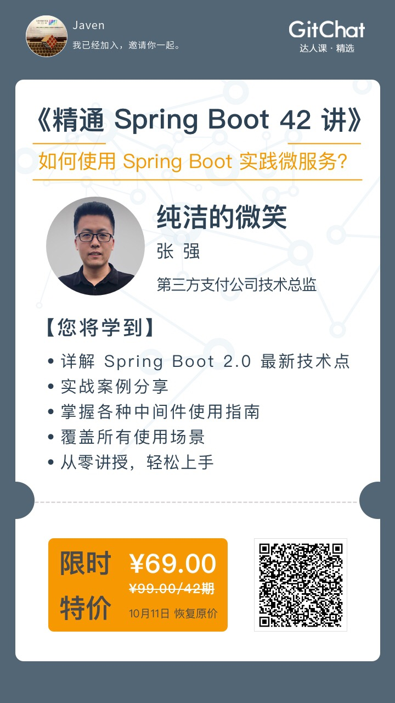

[如何在Spring Boot中配置数据库密码加密](https://github.com/alibaba/druid/wiki/%E5%A6%82%E4%BD%95%E5%9C%A8Spring-Boot%E4%B8%AD%E9%85%8D%E7%BD%AE%E6%95%B0%E6%8D%AE%E5%BA%93%E5%AF%86%E7%A0%81%E5%8A%A0%E5%AF%86%EF%BC%9F)

```
java -cp druid-1.1.10.jar com.alibaba.druid.filter.config.ConfigTools root
privateKey:MIIBVAIBADANBgkqhkiG9w0BAQEFAASCAT4wggE6AgEAAkEA5Ykmel5etYLeyfitKdB/76rMzB3RObsWqozrvsiaD796c8s2bugIJhXwBLLS5OSy42F7L9XVhPZMV5CXdSCEwwIDAQABAkACiSVXrLs3Hh7/9DNVhuwi5awlhR7OmHaDo9Lm5KhvDBUejsMAyydr7YqMc12dBuisQ4mnknsOJEEswAwKMJmhAiEA+WhjHug3QXNrRIL34SCY+QwrDApWPdszyuCVP9UQ+t0CIQDrmkyqxv0TZfNXWt2S3ZHX1blKsA7tuCXAwYLXip50HwIgH7ZLLCngpLzVPc/dTs3DRZ9rdct2rcTKcBhgQc6Iqy0CIC8EuR4v3hu78edSC/weWdfAIF1ma2RHpskkFU+cq2izAiEAnBguRib94AZOtTrZhCTbnj5/rbS14a6DIpuCg7gOW+g=
publicKey:MFwwDQYJKoZIhvcNAQEBBQADSwAwSAJBAOWJJnpeXrWC3sn4rSnQf++qzMwd0Tm7FqqM677Img+/enPLNm7oCCYV8ASy0uTksuNhey/V1YT2TFeQl3UghMMCAwEAAQ==
password:Ub1KM73u64YRWUnXZXe/5XhRwFaWxvx646Y0weLL6CiaHTJm0B0ilW0mup2bLXoI6qN0JowCC+TqCFXHKrv94A==
```


参考资料《精通 Spring Boot 42 讲》

